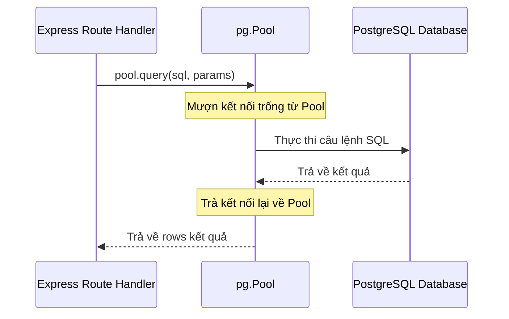

# Hướng dẫn Chuyển đổi sang PostgreSQL & Lộ trình Tự code Backend (GleWorks)

Tài liệu này đóng vai trò là **Bản thiết kế mô hình (Model Design)** và **Hướng dẫn tiếp cận (Approach Guide)** để bạn tự thực hiện việc chuyển đổi cơ sở dữ liệu của `simpleBEDB` từ SQLite sang PostgreSQL. 

Phương pháp này tập trung tối đa vào **tư duy DevOps**:
*   Container hóa dịch vụ Database (Docker Compose).
*   Quản lý cấu hình qua biến môi trường (12-Factor App).
*   Kiểm tra sức khỏe dịch vụ (Container Healthcheck).
*   Tối ưu hiệu năng kết nối (Connection Pooling).
*   Tự động hóa Migration & Seeding.

---

## 📚 Tài nguyên Học tập (Recommended Resources)

1.  **PostgreSQL & SQL Basics:**
    *   [PostgreSQL Official Documentation](https://www.postgresql.org/docs/) - Nguồn tài liệu chuẩn nhất về các kiểu dữ liệu, index và tối ưu hóa.
    *   [SQL Bolt](https://sqlbolt.com/) - Khóa học tương tác cực hay để ôn lại truy vấn SQL từ cơ bản đến nâng cao.
2.  **Node.js & PostgreSQL Driver:**
    *   [node-postgres (pg) Documentation](https://node-postgres.com/) - Driver PostgreSQL phổ biến và ổn định nhất cho Node.js. Xem kỹ phần [Pooling](https://node-postgres.com/features/pooling) và [Transactions](https://node-postgres.com/features/transactions).
3.  **DevOps & Backend Patterns:**
    *   [The Twelve-Factor App - Config](https://12factor.net/config) - Nguyên tắc lưu trữ cấu hình trong môi trường (env vars).
    *   [Docker Compose Healthcheck](https://docs.docker.com/compose/compose-file/compose-file-v3/#healthcheck) - Cách cấu hình container chờ đợi dịch vụ khác sẵn sàng.
    *   [Express Error Handling](https://expressjs.com/en/guide/error-handling.html) - Cách bắt lỗi trong các hàm không đồng bộ (async/await).

---

## 🗄️ Phần 1: Thiết kế Cơ sở dữ liệu (PostgreSQL Schema)

Trong PostgreSQL, tên bảng và cột mặc định sẽ bị chuyển về chữ thường (lowercase) trừ khi được bọc trong dấu ngoặc kép (double quotes). Để tránh việc phải sửa toàn bộ code Frontend (đang giao tiếp dạng `camelCase`), bạn có 2 hướng đi:

> [!TIP]
> **Cách 1 (Khuyên dùng cho Học tập chuyên sâu):** Sử dụng chuẩn `snake_case` cho DB (`first_name`, `last_name`) và viết một hàm chuyển đổi payload (Mapper) ở đầu/cuối API của Express.
> **Cách 2 (Tiết kiệm thời gian sửa code):** Dùng dấu ngoặc kép `"camelCase"` khi định nghĩa bảng/cột trong PostgreSQL để giữ nguyên định dạng.
>
> *Dưới đây là thiết kế SQL DDL theo **Cách 2** để bạn dễ dàng tích hợp với Express API hiện tại.*

### Mã SQL khởi tạo (PostgreSQL DDL)

Bạn sẽ chạy đoạn script này khi khởi chạy ứng dụng lần đầu (Auto-migration):

```sql
-- 1. Tạo kiểu ENUM cho Role (Tính năng nâng cao của PostgreSQL so với SQLite CHECK)
CREATE TYPE user_role AS ENUM ('admin', 'user');

-- 2. Bảng Users
CREATE TABLE IF NOT EXISTS "users" (
  "id" VARCHAR(255) PRIMARY KEY,
  "firstName" VARCHAR(100) NOT NULL,
  "lastName" VARCHAR(100) NOT NULL,
  "phoneNumber" VARCHAR(20) NOT NULL,
  "email" VARCHAR(255) NOT NULL UNIQUE,
  "passwordHash" VARCHAR(255) NOT NULL,
  "dateOfBirth" DATE, -- Postgres hỗ trợ kiểu DATE thực tế thay vì TEXT
  "address" VARCHAR(255) NOT NULL DEFAULT '',
  "city" VARCHAR(100) NOT NULL DEFAULT '',
  "role" user_role NOT NULL DEFAULT 'user',
  "isConfirmed" BOOLEAN NOT NULL DEFAULT TRUE, -- Dùng BOOLEAN thay vì INTEGER 0/1
  "createdAt" TIMESTAMPTZ NOT NULL DEFAULT CURRENT_TIMESTAMP, -- Lưu kèm timezone
  "updatedAt" TIMESTAMPTZ NOT NULL DEFAULT CURRENT_TIMESTAMP
);

-- 3. Bảng Services
CREATE TABLE IF NOT EXISTS "services" (
  "id" SERIAL PRIMARY KEY, -- SERIAL tự động tăng (auto-increment)
  "name" VARCHAR(255) NOT NULL UNIQUE,
  "description" TEXT NOT NULL DEFAULT '',
  "createdAt" TIMESTAMPTZ NOT NULL DEFAULT CURRENT_TIMESTAMP
);

-- 4. Bảng Service Options
CREATE TABLE IF NOT EXISTS "service_options" (
  "id" SERIAL PRIMARY KEY,
  "serviceId" INTEGER NOT NULL REFERENCES "services"("id") ON DELETE CASCADE,
  "optionName" VARCHAR(255) NOT NULL,
  "price" INTEGER NOT NULL DEFAULT 0,
  "optionGroup" VARCHAR(255) NOT NULL,
  "createdAt" TIMESTAMPTZ NOT NULL DEFAULT CURRENT_TIMESTAMP
);

-- 5. Bảng Orders
CREATE TABLE IF NOT EXISTS "orders" (
  "id" VARCHAR(255) PRIMARY KEY,
  "userId" VARCHAR(255) NOT NULL REFERENCES "users"("id") ON DELETE CASCADE,
  "serviceId" INTEGER NOT NULL REFERENCES "services"("id") ON DELETE RESTRICT,
  "totalCost" INTEGER NOT NULL DEFAULT 0,
  "status" VARCHAR(50) NOT NULL,
  "paymentStatus" VARCHAR(50) NOT NULL,
  "address" VARCHAR(255) NOT NULL DEFAULT '',
  "telephone" VARCHAR(20) NOT NULL DEFAULT '',
  "createdAt" TIMESTAMPTZ NOT NULL DEFAULT CURRENT_TIMESTAMP,
  "updatedAt" TIMESTAMPTZ NOT NULL DEFAULT CURRENT_TIMESTAMP
);

-- 6. Bảng Order Details
CREATE TABLE IF NOT EXISTS "order_details" (
  "id" SERIAL PRIMARY KEY,
  "orderId" VARCHAR(255) NOT NULL REFERENCES "orders"("id") ON DELETE CASCADE,
  "fieldName" VARCHAR(255) NOT NULL,
  "fieldValue" TEXT,
  "createdAt" TIMESTAMPTZ NOT NULL DEFAULT CURRENT_TIMESTAMP
);
```

---

## 🐳 Phần 2: Hạ tầng DevOps (Docker Compose & Cấu hình)

Thay vì chạy cài đặt PostgreSQL trực tiếp trên máy (local install), bạn sẽ sử dụng Docker để tạo môi trường DB cô lập và nhất quán.

### 1. Cấu hình dịch vụ Database trong `docker-compose.yml`

Bạn cần bổ sung dịch vụ `db` chạy PostgreSQL dưới dịch vụ `backend`. Hãy cấu hình chi tiết:

```yaml
  db:
    image: postgres:16-alpine
    container_name: gleworks-postgres
    environment:
      POSTGRES_USER: ${POSTGRES_USER:-gleuser}
      POSTGRES_PASSWORD: ${POSTGRES_PASSWORD:-glepassword}
      POSTGRES_DB: ${POSTGRES_DB:-gleworks}
    ports:
      - "5432:5432"
    volumes:
      - pgdata:/var/lib/postgresql/data
    healthcheck:
      test: ["CMD-SHELL", "pg_isready -U $$POSTGRES_USER -d $$POSTGRES_DB"]
      interval: 5s
      timeout: 5s
      retries: 5
    restart: unless-stopped

volumes:
  pgdata:
```

### 2. DevOps Best Practice: Dependency và Healthcheck

Để dịch vụ `backend` không bị crash khi khởi động do database chưa sẵn sàng chấp nhận kết nối:
1.  Sử dụng thuộc tính `depends_on` với điều kiện `service_healthy`.
2.  Cập nhật biến môi trường cho dịch vụ `backend` để lấy thông tin kết nối PostgreSQL:

```yaml
  backend:
    build: ./simpleBEDB
    environment:
      - PORT=3001
      - PGHOST=db
      - PGUSER=gleuser
      - PGPASSWORD=glepassword
      - PGDATABASE=gleworks
      - PGPORT=5432
    depends_on:
      db:
        condition: service_healthy
```

---

## ⚡ Phần 3: Kiến trúc Kết nối (Connection Pooling)

Một sai lầm phổ biến khi mới học BE là tạo kết nối mới tới DB trên mỗi request, hoặc mở một kết nối duy nhất rồi dùng chung cho toàn bộ app.

*   **Single Connection (Một kết nối):** Dễ bị nghẽn (bottleneck) khi có nhiều request đồng thời, do PostgreSQL xử lý truy vấn tuần tự trên một kết nối.
*   **New Connection per request:** Việc bắt tay (handshake), xác thực và cấp phát tài nguyên cho kết nối mới cực kỳ tốn thời gian và CPU.
*   **Connection Pool (Hồ chứa kết nối - Khuyên dùng):** 
    *   Ứng dụng khởi tạo một tập hợp các kết nối sẵn có (ví dụ: tối đa 10 kết nối).
    *   Khi có request, Express "mượn" 1 kết nối từ pool để truy vấn và "trả lại" ngay sau khi hoàn thành.
    *   Giúp tối ưu hóa tài nguyên mạng, tốc độ phản hồi và bảo vệ DB tránh cạn kiệt socket.

### Mô hình hoạt động của Pool trong Node.js (`pg`)



---

## 🏗️ Hướng tiếp cận Code cho Bạn (Step-by-Step Guide)

Để tự mình lập trình và hoàn thành tính năng này, hãy làm theo các bước sau:

### Bước 1: Thay thế Thư viện (Dependencies)
1.  Vào thư mục `simpleBEDB` và gỡ bỏ `better-sqlite3`.
2.  Cài đặt package `pg` (đây là thư viện tương tác PostgreSQL chính thức cho Node.js).
3.  *Lưu ý:* `pg` thuần JS không yêu cầu biên dịch C++ nên tốc độ build Docker image của bạn sẽ nhanh hơn rất nhiều.

### Bước 2: Thiết lập file Kết nối và Khởi tạo (`db.js`)
Bạn cần viết lại file này bằng cách:
1.  Import lớp `Pool` từ thư viện `pg`.
2.  Tạo một instance của `Pool` sử dụng các biến cấu hình từ `process.env` (`PGHOST`, `PGUSER`, `PGPASSWORD`, `PGDATABASE`, `PGPORT`).
3.  Viết hàm `initDatabase()` không đồng bộ (`async`):
    *   Thực hiện truy vấn SQL DDL (tạo các bảng đã thiết kế ở Phần 1).
    *   Viết logic Seeding dữ liệu mẫu: kiểm tra xem bảng `users` đã có dữ liệu chưa. Nếu chưa, thực hiện chèn dữ liệu admin, dịch vụ và đơn hàng mẫu vào.
    *   *Mẹo DevOps:* Khi chèn dữ liệu mẫu cho mật khẩu, bạn cần dùng `bcrypt.hashSync("Admin123!", 10)` giống như phiên bản SQLite để đảm bảo frontend đăng nhập bình thường.

### Bước 3: Chuyển đổi API sang Bất đồng bộ (`server.js`)
SQLite hoạt động đồng bộ (synchronous), do đó code hiện tại trong `server.js` đang gọi trực tiếp `db.prepare().run()`. PostgreSQL của Node.js bắt buộc phải chạy bất đồng bộ (asynchronous).

1.  Đổi toàn bộ route handler thành hàm `async`:
    *   Ví dụ: từ `app.post('/auth/login', (req, res) => { ... })` thành `app.post('/auth/login', async (req, res) => { ... })`.
2.  Sử dụng từ khóa `await` khi truy vấn cơ sở dữ liệu:
    *   Thay đổi cú pháp truy vấn: `pool.query(sql, params)`.
3.  **Thay đổi ký tự tham số (Parameterized Queries):**
    *   SQLite dùng dấu hỏi chấm `?` hoặc `@param`.
    *   PostgreSQL dùng định dạng `$1`, `$2`, `$3` cho các tham số truyền vào.
    *   Ví dụ:
        *   *SQLite:* `SELECT * FROM users WHERE email = ?`
        *   *Postgres:* `SELECT * FROM users WHERE email = $1` (truyền mảng tham số: `[email]`).
4.  **Transaction trong route `POST /orders`:**
    *   Đơn hàng gồm thông tin chung (`orders`) và chi tiết (`order_details`).
    *   Để tránh trường hợp lưu đơn hàng thành công nhưng lưu chi tiết thất bại (làm hỏng tính toàn vẹn dữ liệu), hãy áp dụng transaction:
        ```javascript
        const client = await pool.connect();
        try {
          await client.query('BEGIN');
          // Thực hiện chèn vào bảng orders
          // Thực hiện chèn vào bảng order_details
          await client.query('COMMIT');
        } catch (err) {
          await client.query('ROLLBACK');
          throw err;
        } finally {
          client.release(); // Trả kết nối về pool
        }
        ```

### Bước 4: Tắt ứng dụng an toàn (Graceful Shutdown)
Khi bạn chạy Docker Container, khi container dừng (ví dụ: do update deployment hoặc restart server), hệ thống gửi tín hiệu `SIGTERM`. Bạn cần bắt tín hiệu này để đóng tất cả các kết nối trong `pool` trước khi app dừng hoàn toàn:
```javascript
process.on('SIGTERM', async () => {
  console.log('SIGTERM signal received. Closing HTTP server and DB pool...');
  server.close(async () => {
    await pool.end();
    console.log('HTTP server and DB pool closed.');
    process.exit(0);
  });
});
```

Chúc bạn thực hiện thành công bài thực hành thú vị này để nâng tầm kỹ năng Backend & DevOps của mình! Hãy phản hồi lại nếu bạn gặp khó khăn ở bất kỳ bước nào.
